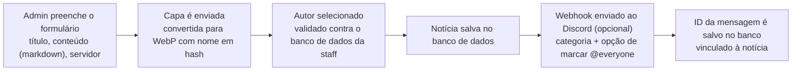
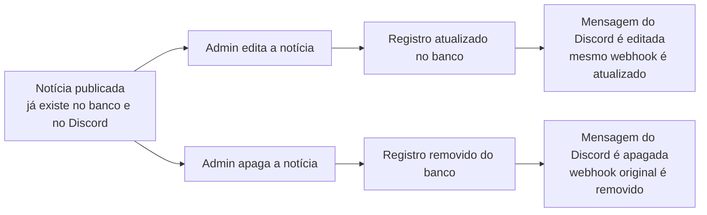

# 🕹️ Rede Nerds

<p align="center">
  
  
  
</p>

<p align="center">
  <strong>O site oficial da Rede Nerds — uma rede de servidores de Minecraft com modpacks exclusivos, tecnologia, magia e muita aventura.</strong>
</p>

<p align="center">
  🔗 <a href="https://redenerds.com.br">redenerds.com.br</a>
</p>

---

## 🌐 Sobre o projeto

Este é o **repositório oficial** do site da Rede Nerds. Tudo que está aqui reflete diretamente o que os jogadores veem em [redenerds.com.br](https://redenerds.com.br).

A Rede Nerds reúne servidores com modpacks de minecraft de propostas variadas, como mundos tecnológicos e/ou apocalípticos.

Apesar da base do site ser HTML/CSS estático, algumas seções são **dinâmicas e dependem de banco de dados**:

- 📰 **`novidades/`** — as notícias exibidas são carregadas a partir do banco de dados.
- 👥 **`equipe/`** — a listagem de membros da staff também é populada dinamicamente via banco.

> ⚠️ **Atenção:** por ser o repositório de produção, alterações aqui vão para o ar. Teste localmente antes de subir qualquer mudança, principalmente nas áreas que dependem do banco de dados.

## 📁 Estrutura do repositório

```
RedeNerds/
├── .github/workflows/   # Automação de deploy (CI/CD)
├── admin/               # Área administrativa
├── assets/images/       # Imagens e recursos visuais do site
├── download/            # Página(s) de download (launcher, mods, etc.)
├── equipe/              # Página da equipe/staff (dinâmico — PHP + banco de dados)
├── errors/404/          # Página de erro personalizada
├── novidades/           # Notícias da rede (dinâmico — PHP + banco de dados)
├── regras/              # Regras da comunidade e dos servidores
├── servidores/          # Informações sobre cada servidor da rede
├── shared/              # Componentes e recursos compartilhados
├── suporte/             # Central de ajuda / suporte aos jogadores
├── index.html           # Página inicial
├── index.css            # Estilos globais
└── .htaccess            # Configurações do servidor Apache
```

## 📰 Sistema de notícias

A área de **notícias** (`novidades/`) não é só HTML estático — ela é gerenciada por um painel de admin (`admin/`) e integrada com o Discord via webhook. Veja como funciona cada etapa.

### Criando uma notícia

1. O admin preenche o formulário no dashboard: **título**, **conteúdo** (com suporte a Markdown) e o **servidor** ao qual a notícia se refere.
2. Faz o upload da **capa**. A imagem é enviada para `assets/novidades`, convertida automaticamente para **WebP** e salva com um **nome em hash** (evitando colisões e nomes previsíveis).
3. Seleciona o **autor** entre os membros da staff. A lista é puxada diretamente do banco de dados da equipe, garantindo que só quem realmente faz parte do time possa ser creditado.
4. A notícia é **salva no banco de dados**.
5. Por padrão, um **webhook é enviado ao Discord** (pode ser desativado na hora da criação), com todas as informações da notícia. A categoria (**atualização** ou **anúncio**) define o formato/canal do webhook, e o admin pode optar por marcar **@everyone** ou não.
6. O **ID da mensagem** retornado pelo Discord é salvo no banco, junto ao registro da notícia — é essa referência que permite editar ou apagar a mensagem certa depois.



### Editando ou apagando uma notícia

O sistema mantém a notícia e a mensagem do Discord **sincronizadas**: o ID da mensagem do webhook é guardado junto ao registro da notícia no banco, permitindo editar ou apagar a mensagem certa depois.

- **Editar** — atualiza o registro no banco e **edita a mesma mensagem** do Discord com os novos dados.
- **Apagar** — remove o registro do banco e **apaga automaticamente** a mensagem correspondente no Discord.



## 🛠️ Stack

- **HTML5 & CSS3** — base e estilo das páginas
- **PHP** — APIs que alimentam as páginas dinâmicas (notícias e equipe)
- **Banco de dados** — armazena notícias, membros da equipe e demais conteúdos dinâmicos
- **GitHub Actions** — automação de deploy para produção
- **Apache (.htaccess)** — regras de servidor/redirecionamento

## 🤝 Contribuindo

Encontrou um bug ou tem uma sugestão de melhoria para o site?

1. Abra uma [issue](https://github.com/Thiagoalfs/RedeNerds/issues) descrevendo o problema ou a ideia.
2. Se for enviar código, crie uma branch a partir da `main` e abra um Pull Request.
3. Evite alterações diretas na `main` sem revisão, já que ela vai direto para produção.

## 💬 Comunidade

Quer tirar dúvidas, receber suporte da staff ou ficar por dentro das novidades? Entre no nosso [Discord](https://discord.gg/zAwqXqTjG).

## 📄 Licença

Este projeto não possui uma licença open-source definida. Todo o conteúdo, marca e assets pertencem à Rede Nerds.

---

<p align="center">Feito com 💚 pela equipe da Rede Nerds</p>