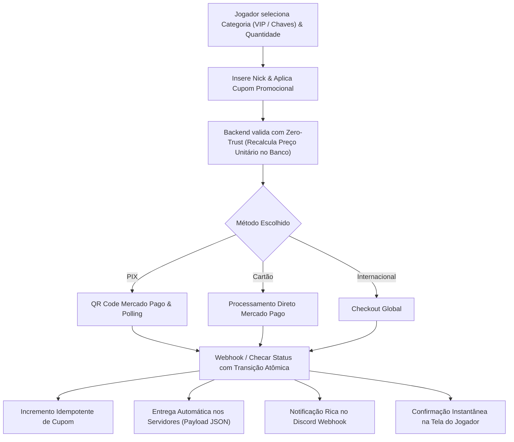

# 🕹️ Rede Nerds

<p align="center">
  
  
  
  
</p>

<p align="center">
  <strong>O site oficial da Rede Nerds — uma rede de servidores de Minecraft com modpacks exclusivos, tecnologia, magia e muita aventura.</strong>
</p>

<p align="center">
  🔗 <a href="https://redenerds.com.br">redenerds.com.br</a>
</p>

---

## 🌐 Sobre o projeto

Este é o **repositório de produção oficial** do site da Rede Nerds. Tudo o que está aqui reflete diretamente a infraestrutura web em [redenerds.com.br](https://redenerds.com.br).

O ecossistema combina páginas otimizadas com SEO completo e seções **dinâmicas alimentadas por APIs REST em PHP e banco de dados MySQL**:

- 💎 **`loja/`** — Loja oficial com checkout transparente (PIX Mercado Pago, Cartão de Crédito e Checkout Internacional), catálogo dinâmico de **VIPs e Pacotes de Chaves**, seletor dinâmico de quantidade, validação de preços **Zero-Trust**, cupons de desconto, entrega automática in-game com payload JSON padronizado e webhooks no Discord.
- 📚 **`wiki/`** — Central de tutoriais e documentação da comunidade com sumário dinâmico (ToC), busca instantânea, lightbox em imagens, callouts estilizados e navegação contínua.
- 🖥️ **`servidores/`** e **Página Inicial** — Detalhes completos de cada servidor, downloads de modpack, cópia de IP em 1 clique, vitrine de parceiros e temas dinâmicos via `/api/servidores_api.php`.
- 👥 **`equipe/`** — Listagem de membros da staff com hierarquia e cores personalizáveis, renderização segura contra XSS, fallback inteligente de skins e carrossel mobile via `/api/equipe_api.php`.
- 📰 **`novidades/`** — Notícias e changelogs com paginação, busca, filtros e tags coloridas por servidor via `/api/novidades_api.php`.
- ⚙️ **`admin/`** — Painel administrativo moderno com sidebar fixa, rate limiting contra força bruta, gestão de vendas, cupons, catálogo de VIPs e Chaves (com upload de imagens), parceiros, servidores, notícias, equipe e wiki.
- 🧪 **`tests/`** — Suíte completa de testes automatizados cobrindo segurança, anti-spoofing de IP, geolocalização, idempotência transacional, atomicidade de webhooks e lógica de cálculo de pacotes.

---

## 📁 Estrutura do repositório

```
RedeNerds/
├── .github/workflows/   # Automação de deploy contínuo (CI/CD)
├── admin/               # Painel Administrativo completo
│   ├── api/             # Endpoints internos protegidos do painel (CRUDs, uploads e ações)
│   │   ├── chaves/      # Endpoints para criação, edição e exclusão de pacotes de chaves
│   │   ├── cupons/      # Endpoints para controle de cupons promocionais
│   │   ├── equipe/      # Endpoints para gestão de cargos e membros da staff
│   │   ├── noticias/    # Endpoints para publicação de notícias e webhook Discord
│   │   ├── parceiros/   # Endpoints para gerenciamento de parceiros da rede
│   │   ├── pedidos/     # Endpoints para consulta e exportação de pedidos
│   │   ├── servidores/  # Endpoints para gestão de servidores e temas
│   │   ├── vips/        # Endpoints para catálogo de VIPs
│   │   └── wiki/        # Endpoints para artigos e categorias da Wiki
│   ├── chaves/          # Gestão de pacotes de chaves com upload de imagem e preview
│   ├── cupons/          # Gestão de cupons de desconto (percentual / fixo)
│   ├── equipe/          # Gestão de membros e hierarquia/cores de cargos
│   ├── includes/        # Componentes compartilhados do admin (Header, Sidebar fixa, Footer, Toolbar)
│   ├── noticias/        # Gestão de novidades com upload WebP e Discord Webhook
│   ├── parceiros/       # Gestão completa de parceiros e banners
│   ├── pedidos/         # Histórico de pedidos (VIPs e Chaves) e exportação CSV compatível com Excel
│   ├── servidores/      # Gestão de servidores e temas
│   ├── vips/            # Gestão do catálogo de pacotes VIP
│   └── wiki/            # Gestão de artigos, categorias e editor Markdown com upload de imagens
├── api/                 # Endpoints REST públicos e protegidos em PHP
│   ├── loja/            # APIs de checkout (PIX, Cartão, Internacional), cupons, webhooks e entrega
│   ├── wiki/            # API da Wiki com busca, artigos e categorias
│   ├── auth_api.php     # Middleware de controle de acesso (Same-Origin & API Key)
│   ├── equipe_api.php   # API pública de membros da equipe
│   ├── novidades_api.php# API pública de notícias com paginação e busca
│   └── servidores_api.php# API pública de servidores e temas
├── assets/              # Recursos visuais (imagens, ícones 3D de redes sociais, capas e uploads)
│   ├── images/          # Ícones 3D oficiais (Instagram, TikTok, YouTube, CurseForge, Discord) e banners
│   └── servidores/      # Ícones oficiais dos servidores da rede
├── download/            # Página de download (launchers, modpacks, etc.)
├── equipe/              # Página pública da equipe (grid desktop, carrossel mobile e anti-XSS)
├── errors/404/          # Página 404 personalizada
├── loja/                # Página Oficial da Loja (painel VIPs & Chaves, checkout interativo)
├── migrations/          # Scripts SQL versionados de atualização estrutural do banco de dados
├── novidades/           # Página pública de notícias e artigos individuais
├── regras/              # Regras da comunidade e dos servidores
├── servidores/          # Página detalhada de cada servidor com specs e download
├── shared/              # Componentes globais (navbar, footer com redes sociais 3D, modais)
├── sobre/               # Página institucional sobre a história e valores da Rede Nerds
├── suporte/             # Central de ajuda / FAQ / suporte aos jogadores
├── tests/               # Suíte de testes unitários e de integração (100% automatizados)
├── wiki/                # Central de Guias & Wiki pública
├── index.html           # Página inicial (Landing Page com vitrine de servidores, parceiros e Discord)
├── index.css            # Estilos da landing page
├── robots.txt           # Diretrizes de indexação SEO e proteção de rotas privadas
└── .htaccess            # Configurações do servidor Apache, compressão, segurança e cache
```

---

## 💎 Loja Oficial & Checkout Multi-Gateway (`loja/`)

A loja da Rede Nerds conta com uma infraestrutura de checkout transparente, robusta e modular:

### 1. Catálogo Dinâmico de Produtos
- **Abas de Categorias (VIPs & Chaves):** Alternância fluida entre pacotes VIP e pacotes de chaves (keys/caixas), respeitando servidores ativos (`enabled = 1`) e suas respectivas identidades visuais.
- **Seletor Dinâmico de Quantidade:** Interface com botões incrementais (`-`/`+`), cálculo de subtotal em tempo real no frontend e campo numérico interativo.
- **Identificação do Jogador:** Validação de nickname (Original vs Pirata) com preview dinâmico de avatar via API de skins.

### 2. Validação Zero-Trust & Segurança no Backend
- **Cálculo de Preço no Servidor:** O frontend envia apenas o `vip_id` (ou `chave_id`) e a `quantidade`. O backend busca o preço unitário oficial no banco de dados e recalcula o valor total, prevenindo manipulação de payload.
- **Sanitização & Clamping:** Proteção contra quantidades inválidas, negativas ou excessivas (limite parametrizado de 1 a 100 unidades por compra).
- **Idempotência de Cupons:** O desconto do cupom só é debitado/incrementado uma única vez após a confirmação irreversível do pagamento.

### 3. Gateways & Detecção Inteligente de Localidade
- **PIX Mercado Pago:** Geração instantânea de QR Code Base64 e código Copia e Cola com polling assíncrono a cada 3 segundos.
- **Cartão de Crédito:** Checkout transparente via Tokenização Mercado Pago.
- **Checkout Internacional:** Suporte a pagamentos globais com redirecionamento otimizado.
- **Detecção de Localidade (`geo_helper.php` & `ip_helper.php`):** Identificação automática de jogadores nacionais ou internacionais combinando headers `CF-IPCountry`, fuso horário e idioma do navegador, com mitigação ativa de *IP spoofing*.

### 4. Entrega Automática & Notificações
- **Transição Atômica de Status:** Verificação de concorrência (`UPDATE ... WHERE status = 'pendente'`) garantindo que apenas um worker processe a entrega, prevenindo duplicações.
- **Payload JSON Padronizado (`delivery_helper.php`):** Despacho padronizado para o endpoint de entrega configurado em `delivery_api_url` no `config.php`:
  ```json
  {
    "tipo": "vip|chave",
    "produto": "Nome do Pacote",
    "quantidade": 1,
    "nick": "PlayerName",
    "servidor": "Survival",
    "txid": "MP-1234567890",
    "valor": 29.90,
    "data": "2026-09-25T22:00:00Z"
  }
  ```
- **Discord Webhooks:** Notificações formatadas no canal financeiro com dados completos da transação, jogador, servidor, método de pagamento, cupom aplicado e comprovante.



---

## 🧪 Suíte de Testes Automatizados (`tests/`)

O projeto conta com uma suíte de testes unitários e de integração em PHP para garantir a estabilidade e segurança das rotas críticas:

```bash
php -d zend.assertions=1 -d assert.exception=1 tests/run_all_tests.php
```

| Suíte de Teste | Arquivo | O que valida |
| :--- | :--- | :--- |
| **Resolução de IP** | `ip_helper_test.php` | Validação de CIDR Cloudflare IPv4, detecção de conexão direta e mitigação de spoofing de IP via headers forjados. |
| **Detecção de Localidade** | `localidade_test.php` | Classificação correta entre comprador nacional e internacional combinando sinais do navegador e `CF-IPCountry`. |
| **Idempotência de Cupom** | `cupom_idempotencia_test.php` | Garante que múltiplos webhooks ou consultas não incrementem o contador de uso do cupom mais de uma vez. |
| **Atomicidade de Transição** | `webhook_atomicidade_test.php` | Impede condições de corrida (race conditions) e entregas duplicadas em requisições simultâneas de webhook. |
| **Proteção contra Falha 503** | `sem_token_503_test.php` | Resposta segura HTTP 503 e bloqueio de criação de pedidos no banco em caso de credenciais ausentes ou inválidas. |
| **Zero-Trust de Chaves** | `chaves_loja_test.php` | Validação de clamping de quantidades, cálculo de valores com cupons no servidor e integridade do payload de entrega. |

---

## ⚙️ Painel Administrativo (`admin/`)

O painel administrativo centraliza toda a gestão do ecossistema com proteção contra força bruta (**Rate Limiting** via tabela `tentativas_login`), layout responsivo e sidebar fixa:

### 1. 📊 Pedidos & Vendas (`admin/pedidos/`)
- Listagem de transações (VIPs e Chaves) com filtros por status (`aprovado`, `pendente`, `cancelado`), servidor e nick.
- Modal com histórico detalhado, txid, payload de entrega e cupom utilizado.
- Exportação em **CSV compatível com Microsoft Excel** com filtros avançados.

### 2. 🔑 Gerenciador de Chaves (`admin/chaves/`)
- Cadastro, edição e exclusão de pacotes de chaves/keys por servidor.
- Upload de imagens com preview instantâneo.
- Configuração de quantidade base, preço unitário e comandos de ativação in-game.

### 3. 🏷️ Gerenciador de Cupons (`admin/cupons/`)
- Criação de cupons promocionais com desconto percentual (%) ou valor fixo (R$).
- Controle de limite de usos, data de validade e valor mínimo de compra.
- Ativação/desativação rápida com 1 clique (`toggle`).

### 4. 💎 Gerenciador de VIPs (`admin/vips/`)
- Cadastro de planos VIP vinculados a servidores com definição de vantagens, duração e preços.

### 5. 🤝 Gerenciador de Parceiros (`admin/parceiros/`)
- Cadastro completo de parceiros, banners, links externos e ordenação para exibição na home.

### 6. 📚 Gestão da Wiki (`admin/wiki/`)
- CRUD completo de artigos e categorias.
- Editor Markdown com preview em tempo real, toolbar e upload de imagens com compressão.

### 7. 📰 Gerenciador de Notícias (`admin/noticias/`)
- Criação e edição de novidades em Markdown com seleção de autor.
- Upload de capas em formato **WebP** com hash anti-colisão.
- Integração bidirecional com Discord Webhook (publicação, edição e remoção de posts via Message ID).

### 8. 🖥️ Gerenciador de Servidores (`admin/servidores/`) & Equipe (`admin/equipe/`)
- Cadastro de servidores, IPs, links de modpack, temas visuais (`themecolor`) e lista de features.
- Gestão de membros da equipe com hierarquia visual e seletor de cores Hexadecimal.

---

## 🔌 APIs REST Centralizadas (`api/`)

| Endpoint | Método | Descrição |
| :--- | :---: | :--- |
| `/api/novidades_api.php` | `GET` | Busca notícias com suporte a paginação, busca (`?q=`) e filtros de servidor |
| `/api/wiki/artigos.php` | `GET` | Busca e listagem de artigos da Wiki com filtros de categoria |
| `/api/wiki/categorias.php` | `GET` | Retorna categorias ativas da Wiki com contadores de artigos |
| `/api/equipe_api.php` | `GET` | Retorna membros da equipe agrupados por cargo com sanitização anti-XSS |
| `/api/servidores_api.php` | `GET` | Retorna servidores habilitados com cores e ícones processados |
| `/api/loja/vips_api.php` | `GET` | Catálogo de produtos (VIPs e Chaves) filtrados por servidores ativos |
| `/api/loja/validar_cupom.php` | `POST` | Valida código de cupom de desconto em tempo real |
| `/api/loja/criar_pix.php` | `POST` | Cria cobrança PIX via Mercado Pago com validação zero-trust de valor |
| `/api/loja/criar_cartao.php` | `POST` | Processa pagamento via cartão de crédito transparente |
| `/api/loja/criar_checkout_internacional.php` | `POST` | Inicia fluxo de checkout para compradores internacionais |
| `/api/loja/checar_status.php` | `GET` | Consulta status do pagamento em tempo real com entrega sob demanda |
| `/api/loja/cancelar_pedido.php` | `POST` | Cancela pedido pendente e libera recursos |
| `/api/loja/webhook_mercadopago.php` | `POST` | Recebimento assíncrono e atômico de notificações de pagamento |
| `/api/loja/localidade.php` | `GET` | Retorna a localidade sugerida (nacional ou internacional) do visitante |

### 🔐 Segurança e Autenticação (`api/auth_api.php`)
- **Requisições Internas (Site):** Requisições originadas do próprio domínio têm acesso liberado de forma transparente via verificação de origem.
- **Requisições Externas (Plugins/Servidores):** Exigem autenticação via Header `X-API-Key` ou parâmetro `?api_key=`, validado contra `API_SECRET_KEY` configurado em `config.php`.

---

## 🎨 Design, Redes Sociais 3D & SEO

- **Redes Sociais Oficiais 3D:** Footer moderno com botões interativos renderizados com imagens 3D em alta resolução:
  - 📸 [Instagram (@rnteamn)](https://www.instagram.com/rnteamn)
  - 🎵 [TikTok (@rede.nerd)](https://www.tiktok.com/@rede.nerd)
  - 📦 [CurseForge (RN Team)](https://www.curseforge.com/members/rnteam/projects)
  - 🎥 [YouTube (@RedeNerd-t3e)](https://www.youtube.com/@RedeNerd-t3e)
  - 💬 [Discord Oficial](https://discord.gg/zAwqXqTjG)
- **Open Graph & Twitter Cards:** Metatags completas para previews visuais em redes sociais e apps de mensagens.
- **Robots.txt & Indexação:** Configurações otimizadas para motores de busca com proteção de diretórios internos e administrativos.

---

## 🛠️ Stack Tecnológica

- **Frontend:** HTML5, CSS3 moderno (design responsivo, paleta escura sólida, variáveis CSS), JavaScript (ES6+ assíncrono, sanitização DOM, carrossel touch).
- **Backend:** PHP 8+ com tipagem estrita (`declare(strict_types=1)`), PDO/MySQLi, cURL e tratamento de exceções.
- **Banco de Dados:** MySQL / MariaDB com constraints relacionais, índices únicos em transações (`txid`) e suporte a migrations versionadas.
- **Gateways & APIs:** Mercado Pago SDK/REST API, Discord Webhooks API, Minecraft Skins API.
- **Qualidade & Segurança:** Suíte de testes automatizados com PHP Assertions, rate limiting de login, sanitização XSS, anti-spoofing Cloudflare e validação Zero-Trust.
- **Infraestrutura:** Servidor Apache com `.htaccess` otimizado (gzip, cache headers, rewrite rules) e GitHub Actions para CI/CD.

---

## 🤝 Contribuindo

1. Abra uma [issue](https://github.com/Thiagoalfs/RedeNerds/issues) descrevendo o problema ou sugestão.
2. Crie uma branch a partir da `main` e envie um Pull Request.
3. Certifique-se de que todos os testes passem executando `php -d zend.assertions=1 -d assert.exception=1 tests/run_all_tests.php`.
4. Evite alterações diretas na `main` sem revisão, pois ela reflete diretamente o ambiente de produção.

---

## 💬 Comunidade

Dúvidas ou suporte? Entre no nosso [Discord Oficial](https://discord.gg/zAwqXqTjG).

---

<p align="center">Feito com 💚 pela equipe da Rede Nerds</p>
