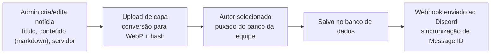

# 🕹️ Rede Nerds

<p align="center">
  
  
  
</p>

<p align="center">
  <strong>O site oficial da Rede Nerds — uma rede de servidores de Minecraft com modpacks exclusivos, tecnologia, magia e muita aventura.</strong>
</p>

<p align="center">
  🔗 <a href="https://redenerds.com.br">redenerds.com.br</a>
</p>

---

## 🌐 Sobre o projeto

Este é o **repositório de produção oficial** do site da Rede Nerds. Tudo que está aqui reflete diretamente o que os jogadores veem em [redenerds.com.br](https://redenerds.com.br).

A Rede Nerds reúne servidores com modpacks de Minecraft de propostas variadas, como mundos tecnológicos, mágicos e/ou apocalípticos.

O site combina páginas otimizadas com SEO completo e seções **dinâmicas alimentadas por APIs em PHP e banco de dados MySQL**:

- 📰 **`novidades/`** — notícias com paginação, busca e filtros carregados via `/api/novidades_api.php`.
- 👥 **`equipe/`** — listagem de membros da staff agrupados por hierarquia via `/api/equipe_api.php`.
- 🖥️ **`servidores/`** e **Página Inicial** — cards de servidores com temas dinâmicos e status via `/api/servidores_api.php`.

---

## 📁 Estrutura do repositório

```
RedeNerds/
├── .github/workflows/   # Automação de deploy (CI/CD)
├── admin/               # Painel Administrativo completo (sessão, notícias, servidores, equipe)
├── api/                 # Endpoints REST públicos em PHP
│   ├── equipe_api.php       # Dados da equipe/staff
│   ├── novidades_api.php    # Notícias (busca, filtros e paginação)
│   └── servidores_api.php   # Servidores ativos e configurações de tema
├── assets/images/       # Imagens e recursos visuais do site
├── download/            # Página de download (launchers, modpacks, etc.)
├── equipe/              # Página pública da equipe/staff
├── errors/404/          # Página 404 personalizada
├── novidades/           # Página pública de notícias e artigos individuais
├── regras/              # Regras da comunidade e dos servidores
├── servidores/          # Página de detalhes dos servidores
├── shared/              # Componentes globais (navbar, footer, estilos compartilhados)
├── suporte/             # Central de ajuda / FAQ / suporte aos jogadores
├── index.html           # Página inicial
├── index.css            # Estilos globais da home
└── .htaccess            # Configurações do servidor Apache e roteamento
```

---

## ⚙️ Painel Administrativo (`admin/`)

O painel administrativo centraliza toda a gestão do site com autenticação protegida por **Rate Limiting** contra força bruta e design system unificado (`dbcommon.css`):

### 1. 📰 Gerenciador de Notícias
* **Criação e Edição:** Suporte completo a Markdown, seleção dinâmica do autor (validado contra o banco da staff) e servidor de referência.
* **Upload Otimizado:** Capas convertidas automaticamente para **WebP** com nomes em hash (anti-colisão).
* **Integração Discord Webhook:** Publicação automática no canal correspondente com embeds formatados, menção `@everyone` opcional e sincronização bidirecional (edição e exclusão sincronizadas via Message ID).



### 2. 🖥️ Gerenciador de Servidores
* **Cadastro Completo:** Nome do servidor, slug automático, IP, link do modpack, descrição e lista dinâmica de features.
* **Ícones Flexíveis:** Suporte a classes FontAwesome, URLs externas ou upload direto de arquivos de imagem.
* **Identidade Visual:** Definição da cor do tema (`themecolor`), que alimenta dinamicamente a cor dos cards no site e badges no dashboard.
* **Coluna Gerada no Banco:** Título da página de cada servidor (`<servername> - Rede Nerds`) gerado automaticamente pelo MySQL.
* **Controle de Exibição:** Ativação/desativação instantânea com botão de visibilidade (`toggle`).

### 3. 👥 Gerenciador de Equipe
* Cadastro e edição de membros da staff organizados por cargos e hierarquias oficiais.

---

## 🔌 APIs Centralizadas (`api/`)

Todas as requisições assíncronas do frontend consomem endpoints REST centralizados na pasta `/api/`:

| Endpoint | Método | Descrição |
| :--- | :---: | :--- |
| `/api/novidades_api.php` | `GET` | Busca notícias com suporte a `?id=`, `?category=`, `?q=`, `?page=` e `?limit=` |
| `/api/equipe_api.php` | `GET` | Retorna membros da equipe agrupados e ordenados por cargo |
| `/api/servidores_api.php` | `GET` | Retorna servidores habilitados com cores e ícones processados |

---

## 🔍 SEO e Redes Sociais

Todas as páginas públicas possuem meta tags completas configuradas para motores de busca e pré-visualização rica em plataformas como Discord, WhatsApp, Twitter/X e Facebook:
* **Open Graph:** `og:title`, `og:description`, `og:image`, `og:url`, `og:type` e `og:locale`.
* **Twitter Cards:** `twitter:card: summary_large_image`, `twitter:title`, `twitter:description` e `twitter:image`.
* **Favicons:** Ícone oficial padronizado em todas as páginas públicas e no painel administrativo.

---

## 🛠️ Stack

- **HTML5 & CSS3** — Interface responsiva, design mobile-first e temas customizados
- **JavaScript (ES6+)** — Consumo assíncrono de APIs e navegação dinâmica
- **PHP 8+** — APIs REST, controladores administrativos e integração de Webhooks
- **MySQL / MariaDB** — Banco de dados relacional com colunas geradas (`STORED`)
- **GitHub Actions** — CI/CD com automação de deploy contínuo para produção
- **Apache (.htaccess)** — Cabeçalhos de segurança, cache e regras de roteamento

---

## 🤝 Contribuindo

Encontrou um bug ou tem uma sugestão de melhoria para o site?

1. Abra uma [issue](https://github.com/Thiagoalfs/RedeNerds/issues) descrevendo o problema ou a sugestão.
2. Se for enviar código, crie uma branch a partir da `main` e abra um Pull Request.
3. Evite alterações diretas na `main` sem revisão, já que ela reflete diretamente o ambiente de produção.

---

## 💬 Comunidade

Quer tirar dúvidas, receber suporte da staff ou jogar com a gente? Entre no nosso [Discord](https://discord.gg/zAwqXqTjG).

---

<p align="center">Feito com 💚 pela equipe da Rede Nerds</p>
