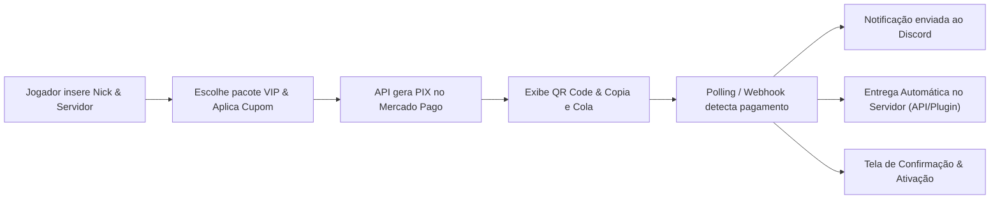

# 🕹️ Rede Nerds

<p align="center">
  
  
  
</p>

<p align="center">
  <strong>O site oficial da Rede Nerds — uma rede de servidores de Minecraft com modpacks exclusivos, tecnologia, magia e muita aventura.</strong>
</p>

<p align="center">
  🔗 <a href="https://redenerds.com.br">redenerds.com.br</a>
</p>

---

## 🌐 Sobre o projeto

Este é o **repositório de produção oficial** do site da Rede Nerds. Tudo o que está aqui reflete diretamente a infraestrutura web em [redenerds.com.br](https://redenerds.com.br).

O ecossistema combina páginas otimizadas com SEO completo e seções **dinâmicas alimentadas por APIs REST em PHP e banco de dados MySQL**:

- 💎 **`loja/`** — Loja oficial com checkout transparente Mercado Pago (PIX automático, cupons de desconto, entrega automática in-game e webhooks no Discord).
- 📚 **`wiki/`** — Central de tutoriais e documentação da comunidade com sumário dinâmico (ToC), busca instantânea, lightbox em imagens, callouts estilizados e navegação contínua.
- 🖥️ **`servidores/`** e **Página Inicial** — Detalhes completos de cada servidor, downloads de modpack, cópia de IP em 1 clique e temas dinâmicos via `/api/servidores_api.php`.
- 👥 **`equipe/`** — Listagem de membros da staff com hierarquia e cores personalizáveis, fallback inteligente de skins e carrossel mobile via `/api/equipe_api.php`.
- 📰 **`novidades/`** — Notícias e changelogs com paginação, busca, filtros e tags coloridas por servidor via `/api/novidades_api.php`.
- ⚙️ **`admin/`** — Painel administrativo moderno com sidebar fixa, rate limiting contra força bruta, gestão de vendas, cupons, servidores, notícias, equipe e wiki.

---

## 📁 Estrutura do repositório

```
RedeNerds/
├── .github/workflows/   # Automação de deploy contínuo (CI/CD)
├── admin/               # Painel Administrativo completo (Dashboard, Vendas, Cupons, Wiki, Equipe, Notícias, Servidores)
│   ├── api/             # Endpoints internos protegidos do painel (CRUDs, uploads e ações)
│   ├── cupons/          # Gestão de cupons de desconto (percentual / fixo)
│   ├── equipe/          # Gestão de membros e hierarquia/cores de cargos
│   ├── includes/        # Componentes compartilhados do admin (Header, Sidebar fixa, Footer, Toolbar)
│   ├── noticias/        # Gestão de novidades com upload WebP e Discord Webhook
│   ├── pedidos/         # Histórico de pedidos e exportação CSV compatível com Excel
│   ├── servidores/      # Gestão de servidores e temas
│   ├── vips/            # Gestão do catálogo de pacotes VIP
│   └── wiki/            # Gestão de artigos, categorias e editor Markdown com upload de imagens
├── api/                 # Endpoints REST públicos e protegidos em PHP
│   ├── loja/            # APIs de checkout PIX, validação de cupons, webhooks e entrega automática
│   ├── wiki/            # API da Wiki com busca, artigos e categorias
│   └── auth_api.php     # Middleware de controle de acesso (Same-Origin & API Key)
├── assets/              # Recursos visuais (imagens, ícones, capas WebP e uploads)
├── download/            # Página de download (launchers, modpacks, etc.)
├── equipe/              # Página pública da equipe (grid desktop e carrossel mobile)
├── errors/404/          # Página 404 personalizada
├── loja/                # Página Oficial da Loja (painel VIPs & checkout PIX interativo)
├── novidades/           # Página pública de notícias e artigos individuais
├── regras/              # Regras da comunidade e dos servidores
├── servidores/          # Página detalhada de cada servidor com specs e download
├── shared/              # Componentes globais (navbar, footer, modal loja, estilos compartilhados)
├── suporte/             # Central de ajuda / FAQ / suporte aos jogadores
├── wiki/                # Central de Guias & Wiki pública
├── index.html           # Página inicial (Landing Page)
├── index.css            # Estilos da home
└── .htaccess            # Configurações do servidor Apache, compressão e cache
```

---

## 💎 Loja Oficial & Checkout PIX Automático (`loja/`)

A loja da Rede Nerds possui checkout transparente e automatizado para pacotes VIP:

1. **Identificação do Jogador:** Validação de nickname (Original vs Pirata) com preview dinâmico de avatar via API de skins.
2. **Catálogo Conectado aos Servidores:** Pacotes VIP vinculados dinamicamente à tabela `servidores`, respeitando servidores ativos (`enabled = 1`) e suas cores temáticas.
3. **Cupons de Desconto:** Validação em tempo real de cupons promocionais (`/api/loja/validar_cupom.php`) com suporte a desconto percentual (%) ou fixo (R$), limite de uso e valor mínimo.
4. **Gateway Mercado Pago (PIX):** Geração instantânea de QR Code Base64 e código PIX Copia e Cola.
5. **Verificação em Tempo Real (Polling & Webhook):** Consulta de aprovação a cada 3 segundos com tela de sucesso imediata e recebimento de Webhook oficial.
6. **Entrega Automática nos Servidores (`api/loja/delivery_helper.php`):** Despacho imediato dos comandos de ativação do VIP para o plugin de entregas nos servidores de Minecraft via HTTP API.
7. **Discord Webhooks:** Notificações formatadas no canal financeiro/loja com dados do pedido, jogador, servidor, cupom aplicado e comprovante.



---

## 📚 Central de Wiki & Guias da Comunidade (`wiki/`)

O sistema de Wiki oferece uma experiência de documentação completa e rica para os jogadores:

* **Busca Instantânea & Filtros:** Pesquisa em tempo real com destaque (*highlight*) de termos e filtro por categorias.
* **Sumário Dinâmico (ToC):** Índice lateral gerado automaticamente a partir dos títulos (`H2`, `H3`) do artigo com *Scroll Spy* ativo.
* **Caixas de Aviso Estilizadas (*Gamer Callouts*):** Formatações visuais exclusivas para dicas, avisos importantes e notas de perigo/cuidado.
* **Lightbox de Imagens:** Clique em qualquer imagem de artigo para abrir o visualizador com zoom em tela cheia.
* **Navegação Contínua:** Botões inteligentes de "Artigo Anterior" e "Próximo Artigo" ao final de cada guia.
* **Editor Markdown no Painel Admin (`admin/wiki/`):**
  * Barra de ferramentas rápida (*Markdown Toolbar*) para inserção de negrito, listas, títulos, código e callouts em 1 clique.
  * Upload direto de imagens com conversão e inserção imediata no texto.
  * Gerenciamento de categorias com contadores de artigos e hierarquia.
  * Notificações automáticas no Discord na publicação de novos tutoriais.

---

## 👥 Página da Equipe & Staff (`equipe/`)

* **Identidade Visual por Cargo:** Nametags com gradientes e barras temáticas exclusivas para cada hierarquia:
  * 🔵 **Fundadores** (Azul)
  * 🟡 **Gerentes / Diretores** (Amarelo)
  * 🩵 **Coordenadores** (Azul Bebê)
  * 🔴 **Administradores** (Vermelho)
  * 🟢 **Moderadores** (Verde)
  * 🟠 **Designers** (Laranja)
  * 🟣 **Desenvolvedores** (Roxo)
* **Gerenciamento de Hierarquia no Painel Admin (`admin/equipe/manage.php`):** Criação e edição de cargos com seletor de cor Hexadecimal, preview dinâmico em tempo real e ordenação.
* **Atalho Rápido de Membros:** Botão de `+ Adicionar` direto no cabeçalho de cada categoria na listagem admin com pré-seleção automática do cargo.
* **Carrossel Mobile Inteligente:** No celular, categorias com mais de 3 membros se transformam automaticamente em um carrossel horizontal suave com *scroll snap* e setas de navegação.
* **Fallback Anti-Falha:** Caso a API de skins esteja indisponível, o sistema carrega automaticamente a skin padrão do Steve sem quebrar o layout.

---

## 📰 Notícias & Novidades (`novidades/`)

* **Badges e Destaques por Servidor:** Tags de categoria coloridas com estilo *pill badge* translúcido para cada servidor da rede (`CobbleNerd`, `NerdSky`, `Potato Nerd`, `NerdDead`, `Sistemas`, `Potato Sky`).
* **Artigos Individuais:** Página dedicada com cabeçalho colorido dinamicamente conforme a categoria, renderização Markdown, tempo de leitura e informações do autor.
* **Filtros e Paginação:** Busca instantânea por termos e filtro por servidores com pontos de identificação coloridos.

---

## 🖥️ Página de Detalhes dos Servidores (`servidores/`)

* **Hero Banner Dinâmico:** Ícone oficial do servidor, status de conexão `🟢 ONLINE`, e caixa de cópia rápida de IP com botão 1-clique.
* **Layout Gamer 2 Colunas:** Divisão clara entre a história/descrição do servidor, grade de recursos/vantagens e sidebar lateral com especificações técnicas (*Plataforma, Modloader, Proteção*).
* **Integração com Modpack & Loja:** Botão direto de download do modpack e atalho para os pacotes VIP do servidor específico.

---

## ⚙️ Painel Administrativo (`admin/`)

O painel administrativo centraliza toda a gestão do site com proteção contra força bruta (**Rate Limiting** na tabela `tentativas_login`), sidebar lateral fixa com rolagem independente e layout responsivo:

### 1. 📊 Pedidos & Exportação de Vendas (`admin/pedidos/`)
* Listagem completa de transações com status (`aprovado`, `pendente`, `cancelado`), valor, servidor e nick do jogador.
* Modal de detalhes do pedido com histórico, txid, cupom utilizado e logs de entrega.
* Exportação em **CSV compatível com Microsoft Excel** com filtros de período e opção de "Apenas Aprovados".

### 2. 🏷️ Gerenciador de Cupons (`admin/cupons/`)
* Criação de códigos promocionais com desconto em porcentagem (%) ou valor fixo (R$).
* Configuração de limite máximo de usos, validade e valor mínimo do carrinho.
* Ativação/desativação rápida com 1 clique (`toggle`).

### 3. 📚 Gestão da Wiki (`admin/wiki/`)
* CRUD completo de artigos e categorias.
* Editor Markdown com preview, toolbar e upload de imagens.

### 4. 📰 Gerenciador de Notícias (`admin/noticias/`)
* Criação e edição com Markdown e seleção do autor.
* Upload de capas em formato **WebP** com nomes em hash (anti-colisão).
* Integração Discord Webhook com publicação, edição e exclusão de mensagens no Discord via Message ID.

### 5. 🖥️ Gerenciador de Servidores (`admin/servidores/`)
* Cadastro completo: nome, IP, link do modpack, descrição e lista dinâmica de features.
* Cor do tema (`themecolor`) que alimenta os cards em todo o site.

### 6. 👥 Gerenciador de Equipe (`admin/equipe/`)
* Adição e edição de membros com atalho por cargo.
* Painel de hierarquia de cargos com seletor de cores HEX.

---

## 🔌 APIs REST Centralizadas (`api/`)

| Endpoint | Método | Descrição |
| :--- | :---: | :--- |
| `/api/novidades_api.php` | `GET` | Busca notícias com suporte a paginação, busca (`?q=`) e filtros |
| `/api/wiki/artigos.php` | `GET` | Busca e listagem de artigos da Wiki com filtros de categoria |
| `/api/wiki/categorias.php` | `GET` | Retorna categorias ativas da Wiki com contadores de artigos |
| `/api/equipe_api.php` | `GET` | Retorna membros da equipe agrupados por cargo |
| `/api/servidores_api.php` | `GET` | Retorna servidores habilitados com cores e ícones processados |
| `/api/loja/vips_api.php` | `GET` | Catálogo de pacotes VIP filtrados por servidores com `enabled = 1` |
| `/api/loja/validar_cupom.php` | `POST` | Valida código de cupom de desconto para o checkout |
| `/api/loja/criar_pix.php` | `POST` | Cria cobrança PIX via Mercado Pago e registra pedido no banco |
| `/api/loja/checar_status.php` | `GET` | Consulta status do pagamento PIX em tempo real |
| `/api/loja/webhook_mercadopago.php` | `POST` | Recebimento assíncrono de notificações de pagamento do gateway |

### 🔐 Segurança e Autenticação (`api/auth_api.php`)
* **Requisições Internas (Site):** Requisições originadas do próprio domínio (`redenerds.com.br` ou `localhost`) têm acesso liberado de forma transparente.
* **Requisições Externas (Plugins/Servidores):** Exigem autenticação via Header `X-API-Key` ou parâmetro `?api_key=`, validado contra `API_SECRET_KEY` configurado em `config.php`.

---

## 🔍 SEO e Redes Sociais

Todas as páginas públicas possuem meta tags completas configuradas para motores de busca e pré-visualização rica em plataformas como Discord, WhatsApp, Twitter/X e Facebook:
* **Open Graph:** `og:title`, `og:description`, `og:image`, `og:url`, `og:type` e `og:locale`.
* **Twitter Cards:** `twitter:card: summary_large_image`, `twitter:title`, `twitter:description` e `twitter:image`.
* **Favicons:** Ícone oficial padronizado em todas as páginas públicas e no painel administrativo.

---

## 🛠️ Stack

- **HTML5 & CSS3** — Interface responsiva, design mobile-first, tipografia Poppins e paleta escura sólida
- **JavaScript (ES6+)** — Consumo assíncrono de APIs, carrossel por gestos, engine de checkout PIX e visualizador Lightbox
- **PHP 8+** — APIs REST, controladores administrativos, integração Mercado Pago, Discord Webhooks e entrega nos servidores
- **MySQL / MariaDB** — Banco de dados relacional com colunas geradas (`STORED`) e compatibilidade universal PDO/MySQLi
- **GitHub Actions** — CI/CD com automação de deploy contínuo para produção
- **Apache (.htaccess)** — Cabeçalhos de segurança, cache e regras de roteamento

---

## 🤝 Contribuindo

1. Abra uma [issue](https://github.com/Thiagoalfs/RedeNerds/issues) descrevendo o problema ou sugestão.
2. Crie uma branch a partir da `main` e envie um Pull Request.
3. Evite alterações diretas na `main` sem revisão, pois ela reflete diretamente o ambiente de produção.

---

## 💬 Comunidade

Dúvidas ou suporte? Entre no nosso [Discord Oficial](https://discord.gg/zAwqXqTjG).

---

<p align="center">Feito com 💚 pela equipe da Rede Nerds</p>
