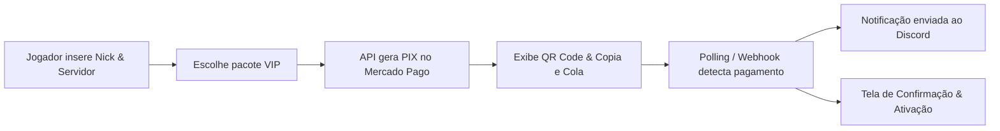

# 🕹️ Rede Nerds

<p align="center">
  
  
  
</p>

<p align="center">
  <strong>O site oficial da Rede Nerds — uma rede de servidores de Minecraft com modpacks exclusivos, tecnologia, magia e muita aventura.</strong>
</p>

<p align="center">
  🔗 <a href="https://redenerds.com.br">redenerds.com.br</a>
</p>

---

## 🌐 Sobre o projeto

Este é o **repositório de produção oficial** do site da Rede Nerds. Tudo que está aqui reflete diretamente a infraestrutura web em [redenerds.com.br](https://redenerds.com.br).

O ecossistema combina páginas otimizadas com SEO completo e seções **dinâmicas alimentadas por APIs REST em PHP e banco de dados MySQL**:

- 💎 **`loja/`** — Loja oficial integrada com Mercado Pago (PIX automático, QR Code, verificação em tempo real e notificações no Discord).
- 🖥️ **`servidores/`** e **Página Inicial** — Detalhes completos de cada servidor, downloads de modpack, cópia de IP em 1 clique e temas dinâmicos via `/api/servidores_api.php`.
- 👥 **`equipe/`** — Listagem de membros da staff com cores temáticas por cargo, fallback inteligente de skins e carrossel mobile via `/api/equipe_api.php`.
- 📰 **`novidades/`** — Notícias com paginação, busca e filtros carregados via `/api/novidades_api.php`.
- ⚙️ **`admin/`** — Painel administrativo protegido com Rate Limiting e gerenciamento de notícias, servidores e equipe.

---

## 📁 Estrutura do repositório

```
RedeNerds/
├── .github/workflows/   # Automação de deploy contínuo (CI/CD)
├── admin/               # Painel Administrativo completo (sessão, notícias, servidores, equipe)
├── api/                 # Endpoints REST protegidos em PHP (autenticação por API Key / middleware)
├── assets/images/       # Imagens e recursos visuais do site
├── download/            # Página de download (launchers, modpacks, etc.)
├── equipe/              # Página pública da equipe (grid desktop e carrossel mobile)
├── errors/404/          # Página 404 personalizada
├── loja/                # Página Oficial da Loja (painel VIPs & checkout PIX interativo)
├── novidades/           # Página pública de notícias e artigos individuais
├── regras/              # Regras da comunidade e dos servidores
├── servidores/          # Página detalhada de cada servidor com specs e download
├── shared/              # Componentes globais (navbar, footer, modal loja, estilos compartilhados)
├── suporte/             # Central de ajuda / FAQ / suporte aos jogadores
├── index.html           # Página inicial
├── index.css            # Estilos da home
└── .htaccess            # Configurações do servidor Apache, compressão e cache
```

---

## 💎 Loja Oficial & Checkout PIX Automático (`loja/`)

A loja da Rede Nerds possui checkout transparente e automatizado para pacotes VIP:

1. **Identificação do Jogador:** Validação de nickname (Original vs Pirata) com preview dinâmico de avatar via API de skins.
2. **Catálogo Conectado aos Servidores:** Pacotes VIP vinculados dinamicamente à tabela `servidores`, respeitando servidores ativos (`enabled = 1`) e suas cores temáticas.
3. **Gateway Mercado Pago (PIX):** Geração instantânea de QR Code Base64 e código PIX Copia e Cola.
4. **Verificação em Tempo Real (Polling & Webhook):** Consulta de aprovação a cada 3 segundos com tela de sucesso imediata e recebimento de Webhook oficial.
5. **Discord Webhooks:** Notificações formatadas no canal financeiro/loja com dados do pedido, jogador, servidor e comprovante.



---

## 👥 Página da Equipe & Staff (`equipe/`)

* **Identidade Visual por Cargo:** Nametags com gradientes e barras temáticas exclusivas para cada hierarquia:
  * 🔵 **Fundadores** (Azul)
  * 🟡 **Gerentes / Diretores** (Amarelo)
  * 🩵 **Coordenadores** (Azul Bebê)
  * 🔴 **Administradores** (Vermelho)
  * 🟢 **Moderadores** (Verde)
  * 🟠 **Designers** (Laranja)
  * 🟣 **Desenvolvedores** (Roxo)
* **Carrossel Mobile Inteligente:** No celular, categorias com mais de 3 membros se transformam automaticamente em um carrossel horizontal suave com *scroll snap* e setas de navegação.
* **Fallback Anti-Falha:** Caso a API de skins esteja indisponível, o sistema carrega automaticamente a skin padrão do Steve sem quebrar o layout.

---

## 🖥️ Página de Detalhes dos Servidores (`servidores/`)

* **Hero Banner Dinâmico:** Ícone oficial do servidor, status de conexão `🟢 ONLINE`, e caixa de cópia rápida de IP com botão 1-clique.
* **Layout Gamer 2 Colunas:** Divisão clara entre a história/descrição do servidor, grade de recursos/vantagens e sidebar lateral com especificações técnicas (*Plataforma, Modloader, Proteção*).
* **Integração com Modpack & Loja:** Botão direto de download do modpack e atalho para os pacotes VIP do servidor específico.

---

## ⚙️ Painel Administrativo (`admin/`)

O painel administrativo centraliza toda a gestão do site com proteção contra força bruta (**Rate Limiting** na tabela `tentativas_login`) e design system unificado (`dbcommon.css`):

### 1. 📰 Gerenciador de Notícias
* **Criação e Edição:** Suporte a Markdown, seleção do autor puxado da equipe e vinculação a servidores.
* **Upload Otimizado:** Capas convertidas automaticamente para **WebP** com nomes em hash (anti-colisão).
* **Integração Discord Webhook:** Publicação automática no canal correspondente com embeds formatados, menção `@everyone` opcional e sincronização bidirecional (edição e exclusão via Message ID).

### 2. 🖥️ Gerenciador de Servidores
* **Cadastro Completo:** Nome, IP, link do modpack, descrição e lista dinâmica de features.
* **Ícones Flexíveis:** Suporte a classes FontAwesome, URLs externas ou upload de imagem.
* **Identidade Visual:** Definição da cor do tema (`themecolor`), que alimenta dinamicamente a cor dos cards no site.
* **Controle de Exibição:** Ativação/desativação instantânea (`enabled = 1/0`).

### 3. 👥 Gerenciador de Equipe
* Cadastro e edição de membros da staff organizados por cargos e ordem de exibição.

---

## 🔌 APIs REST Centralizadas (`api/`)

| Endpoint | Método | Descrição |
| :--- | :---: | :--- |
| `/api/novidades_api.php` | `GET` | Busca notícias com suporte a paginação, busca (`?q=`) e filtros |
| `/api/equipe_api.php` | `GET` | Retorna membros da equipe agrupados por cargo |
| `/api/servidores_api.php` | `GET` | Retorna servidores habilitados com cores e ícones processados |
| `/api/loja/vips_api.php` | `GET` | Catálogo de pacotes VIP filtrados por servidores com `enabled = 1` |
| `/api/loja/criar_pix.php` | `POST` | Cria cobrança PIX via Mercado Pago e registra pedido no banco |
| `/api/loja/checar_status.php` | `GET` | Consulta status do pagamento PIX em tempo real (`pendente`, `pago`, etc.) |
| `/api/loja/webhook_mercadopago.php` | `POST` | Recebimento assíncrono de notificações de pagamento do gateway |

### 🔐 Segurança e Autenticação (`api/auth_api.php`)
* **Requisições Internas (Site):** Requisições originadas do próprio domínio (`redenerds.com.br` ou `localhost`) têm acesso liberado de forma transparente.
* **Requisições Externas (Plugins/Servidores):** Exigem autenticação via Header `X-API-Key` ou parâmetro `?api_key=`, validado contra `API_SECRET_KEY` configurado em `config.php`.

---

## 🔍 SEO e Redes Sociais

Todas as páginas públicas possuem meta tags completas configuradas para motores de busca e pré-visualização rica em plataformas como Discord, WhatsApp, Twitter/X e Facebook:
* **Open Graph:** `og:title`, `og:description`, `og:image`, `og:url`, `og:type` e `og:locale`.
* **Twitter Cards:** `twitter:card: summary_large_image`, `twitter:title`, `twitter:description` e `twitter:image`.
* **Favicons:** Ícone oficial padronizado em todas as páginas públicas e no painel administrativo.

---

## 🛠️ Stack

- **HTML5 & CSS3** — Interface responsiva, design mobile-first, tipografia Poppins e paleta escura sólida
- **JavaScript (ES6+)** — Consumo assíncrono de APIs, carrossel por gestos e engine de checkout PIX
- **PHP 8+** — APIs REST, controladores administrativos, integração com Mercado Pago e Discord Webhooks
- **MySQL / MariaDB** — Banco de dados relacional com colunas geradas (`STORED`) e compatibilidade universal PDO/MySQLi
- **GitHub Actions** — CI/CD com automação de deploy contínuo para produção
- **Apache (.htaccess)** — Cabeçalhos de segurança, cache e regras de roteamento

---

## 🤝 Contribuindo

1. Abra uma [issue](https://github.com/Thiagoalfs/RedeNerds/issues) descrevendo o problema ou sugestão.
2. Crie uma branch a partir da `main` e envie um Pull Request.
3. Evite alterações diretas na `main` sem revisão, pois ela reflete diretamente o ambiente de produção.

---

## 💬 Comunidade

Dúvidas ou suporte? Entre no nosso [Discord Oficial](https://discord.gg/zAwqXqTjG).

---

<p align="center">Feito com 💚 pela equipe da Rede Nerds</p>
